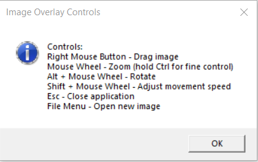
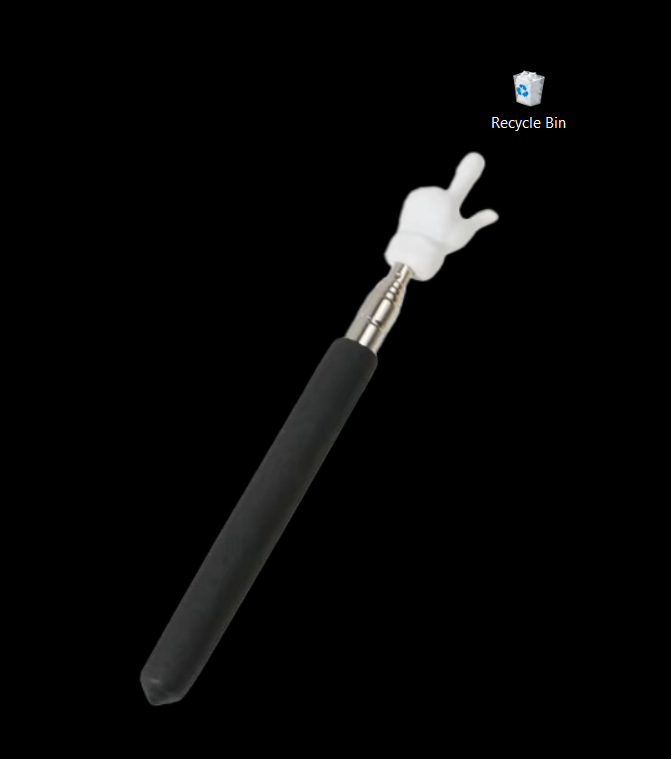

# 🖼️ Image or Gif Overlay Tool

**A lightweight utility to display images and animated GIFs as always-on-top overlays**

##  Installation
1. Download the latest release from [Releases section](https://github.com/Falkkosf/ImageOrGifOverlayWIN10/releases/tag/ImageOverlay))
2. Run `ImageOrGifOverlayWIN10.exe`

